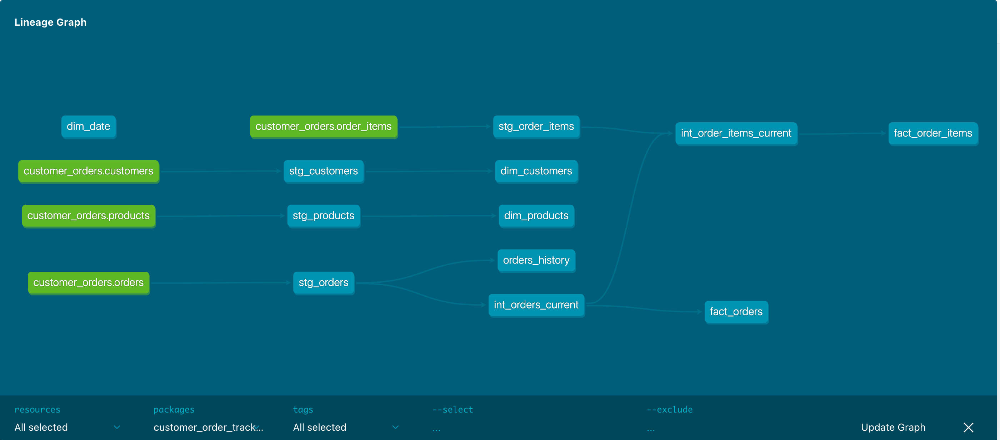

# Analytics API

A FastAPI-based analytics API for querying KPIs from the data warehouse.  
Supports **order-level, order-item-level, customer, product, and date KPIs** with secure API access.

---

## Table of Contents

1. [Overview](#overview)  
2. [Features](#features)  
3. [Project Structure](#project-structure)  
4. [Prerequisites](#prerequisites)  
5. [Setup & Run Locally](#setup--run-locally)  
6. [Docker Deployment](#docker-deployment)
7. [Troubleshooting](#troubleshooting) 

---

## Overview
This API exposes KPIs from the `dev_mart` schema in PostgreSQL:

- Fact tables: `fact_orders`, `fact_order_items`  
- Dimension tables: `dim_customer`, `dim_product`, `dim_date`  
- Supports historical data via SCD2 snapshots.  

---

## Features
- Secure API using **API Key** authentication  
- KPIs available via REST endpoints:  
  - Open orders by delivery date and status  
  - Top 3 delivery dates by open orders  
  - Open pending items by product  
  - Top 3 customers by pending orders  
- Modular, maintainable structure for production-ready deployment

---

## Project Structure
```
 analytics_api
|-- app
|   |-- auth.py      # API key authentication logic
|   |-- db.py        # Database connection and query helper
|   |-- main.py      # FastAPI application and endpoints
|   |-- queries.py   # SQL queries for all KPIs
|-- Dockerfile       # SQL queries for all KPIs
`-- requirements.txt # Python dependencies
```

##Setup & Run Locally
 - Fork the original repo and add these files

### Create a virtual environment:
```
python -m venv venv
source venv/bin/activate  # Mac/Linux
```
### Install dependencies:
```
pip install -r requirements.txt
```

### run dbt models
 - for local dbt run create a local profile yml that will be in your machine and not exposed to outside world to keep the sensitive credentials safe
 - install dbt-core and postgres adaptar
 - dbt debug(if everything is fine with setup)
 - Run a single model
    ```
    dbt run --select stg_orders --target dev
    ```
 - Run all models with a tag
   ````
   dbt run --select 'tag:stg' --target:dev
   ```
 - Generate and serve docs locally
    ```dbt docs generate```
    ```dbt docs serve```
 This is how the dbt lineage will look like on dbt docs
 
 
 This is how you can run all other models to create/update tables in postgres db.
### Create .env file:
```
DB_HOST=127.0.0.1
DB_PORT=5432
DB_USER=your_user
DB_PASSWORD=your_password
DB_NAME=dev_mart
API_KEY=mysecretapikey
```
### Run the API locally:
```commandline
uvicorn main:app --reload --port 3000
```
### Test endpoints:
```
curl -H "x-api-key: mysecretapikey" http://127.0.0.1:3000/analytics/orders
```
## Docker Deployment
```
docker build -t analytics-api:v1.0 .
```
## run docker container
```
docker run -d \
  --name analytics-api \
  -p 3000:3000 \
  --env-file .env \
  analytics-api:v1.0
```
## check endpoint
```
curl -H "x-api-key: mysecretapikey" http://127.0.0.1:3000/analytics/orders
```

##Troubleshooting
 - DB connection errors: Ensure Postgres is running, .env credentials are correct.
 - Endpoints return empty results: Check your fact_orders and fact_order_items tables for relevant is_open / is_pending rows.
 - Docker errors: Make sure ports are free and .env is correctly passed.

